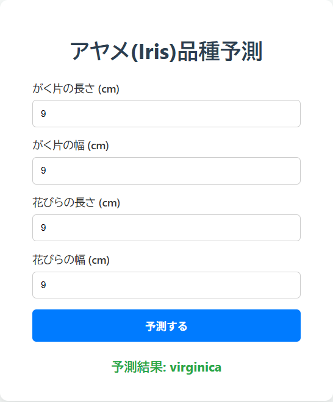

# Iris Classifier Web Application (アヤメ品種分類 Webアプリ)



## 1. 概要 (Overview)

このプロジェクトは、アヤメ(Iris)の計測データから品種を予測する機械学習モデルを搭載した、シンプルなWebアプリケーションです。

ユーザーフレンドリーなUIから数値を入力するだけで、誰でも簡単に品種予測を試すことができます。バックエンドはFastAPI、フロントエンドは基本的なHTML/CSS/JavaScriptで構築されており、全体がDockerコンテナとしてパッケージ化されています。

## 2. 技術スタック (Tech Stack)

* **言語:** Python 3
* **Webフレームワーク (Backend):** FastAPI
* **フロントエンド:** HTML, CSS, JavaScript
* **機械学習:** scikit-learn, joblib, pandas
* **コンテナ化:** Docker
* **バージョン管理:** Git, GitHub

## 3. 使い方 (Usage)

1.  このリポジトリをクローンまたはダウンロードします。
2.  お使いの環境にDockerがインストールされていることを確認します。
3.  リポジトリのルートディレクトリで、以下のコマンドを実行してDockerイメージをビルドします。
    ```bash
    docker build -t iris-api .
    ```
4.  以下のコマンドでコンテナを起動します。
    ```bash
    docker run -p 8000:80 iris-api
    ```
5.  **Webブラウザで `http://localhost:8000` にアクセスしてください。** 表示された画面から、数値を入力して品種を予測できます。

---

## 4. 開発者向け情報 (For Developers)

### API仕様書

このアプリケーションが内部で使用しているAPIの仕様は、コンテナ起動中に `http://localhost:8000/docs` へアクセスすることで、Swagger UI形式のドキュメントとして閲覧・テストできます。

### APIエンドポイント: `POST /predict`

アヤメの計測データをJSON形式で送信すると、予測される品種名を返します。

**リクエストボディ:**
```json
{
  "sepal_length": 5.1,
  "sepal_width": 3.5,
  "petal_length": 1.4,
  "petal_width": 0.2
}
```

**レスポンス:**
```json
{
  "prediction": "setosa"
}
